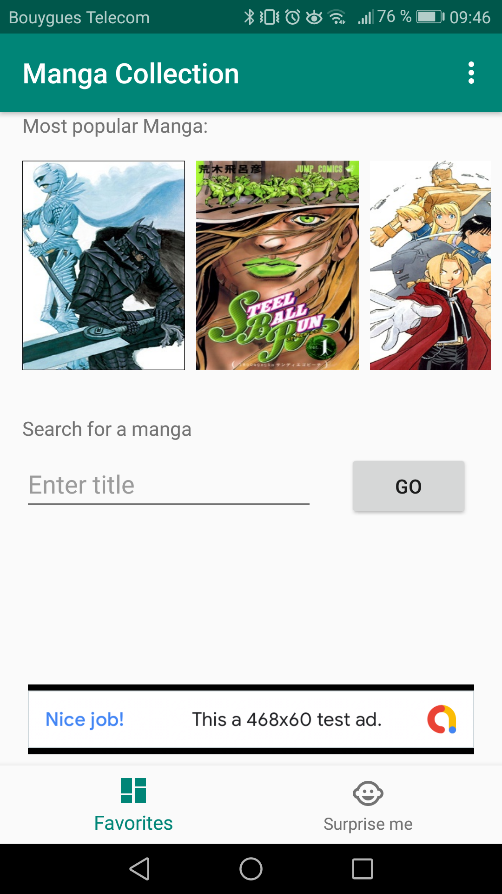
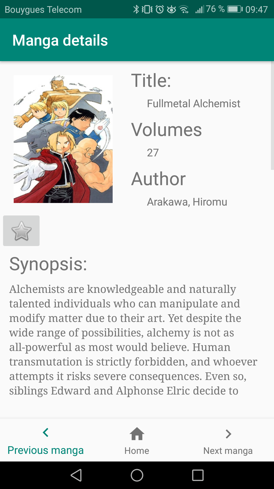
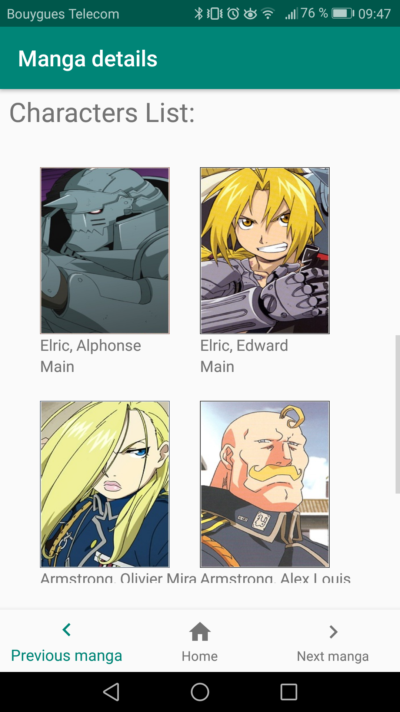
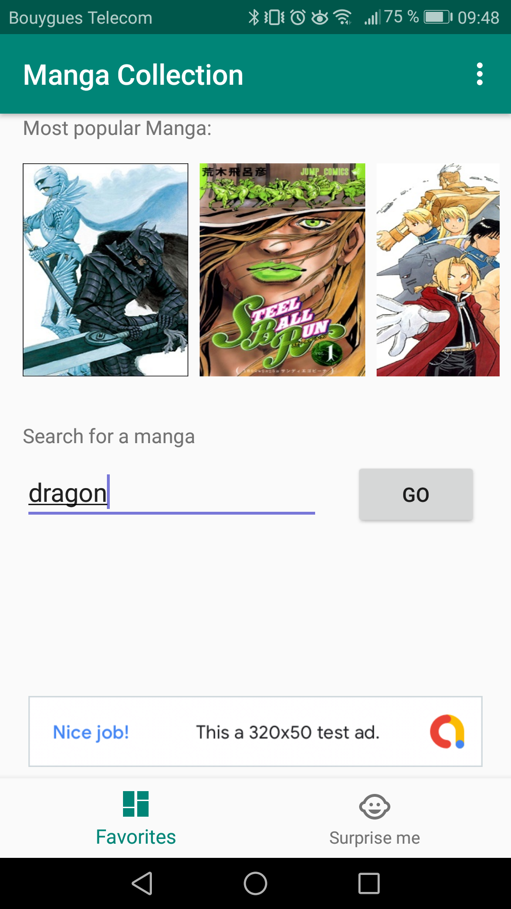
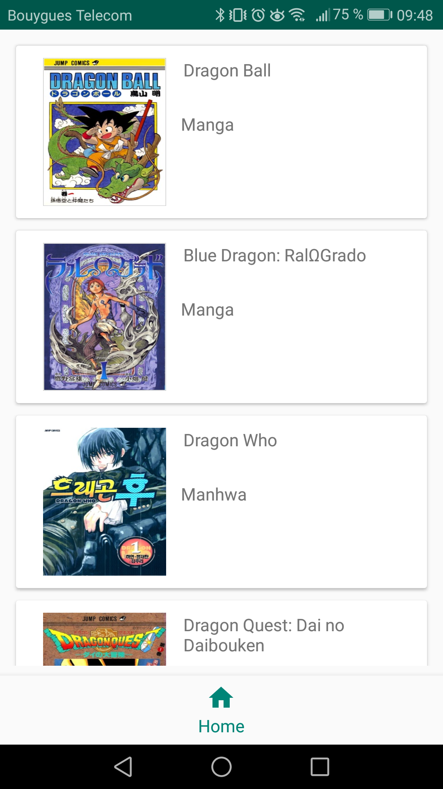

# MangaCollection

## Présentation
Projet de programmation mobile Android utilisant l'architecture MVC 
Cette application utilise l'APIRest Jikan (https://jikan.docs.apiary.io/#) pour permettre à l'utilisateur de rechercher des manga 

## Consigne 
- Appel REST
- 2 écrans minimum  : home screen et detail des objets
- MVC
- Gestion du projet via Gitflow

## Fonctionnalité 

- affiche les posters des manga les plus populaires sur https://myanimelist.net et permet d'avoir des details en cliquant dessus

### Home Screen

### Details Screen

  

- recherche de manga par titre

### Search Screen
 

Note:le site MyAnimelist.net recenssant tout type de manga il peut être possible d'avoir des manga pouvant heurter la sensibilté
de certaine personne

- recheche d'un manga aléatoire par le bouton "Suprise Me"
- bannière publicitaire par [Google Admob Service](https://www.google.com/admob/)

## Evolution possible
- intégration du Sign In via Google pour sauvegarder les favoris
- Refonte visuel de l'application
- Introduction du ViewModel

